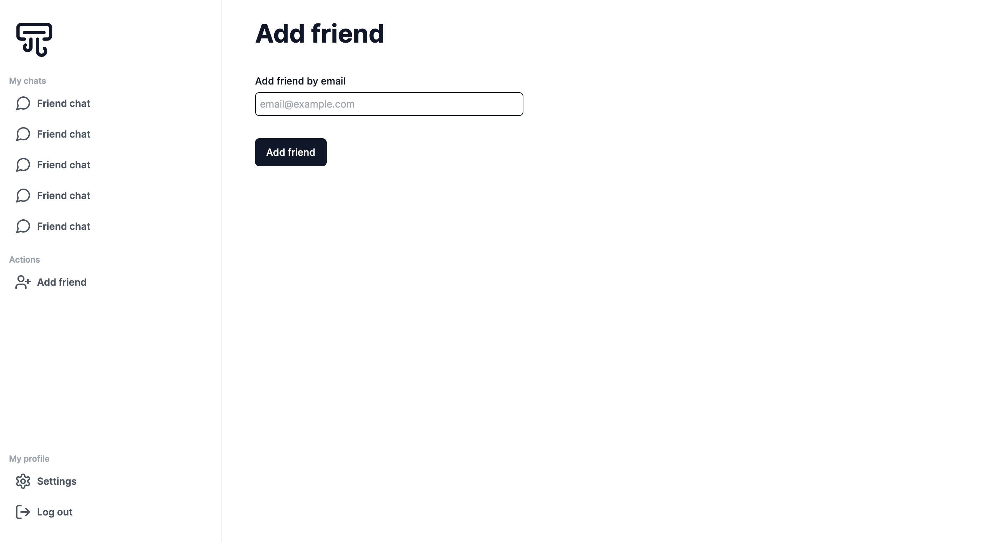

## ChatNet

This is a realtime chat application built with React Server Components/Next 13's App Directory. I am using Redis for the database to enable quick almost instant realtime chat.

### Technologies Used

- [`NextJS / TypeScript`](https://nextjs.org/) : Front-end / API
- [`Redis`](https://redis.io/) : Database
- [`TailwindCSS`](https://tailwindcss.com/) : Styling

##### Others
- [`Upstash`](https://upstash.com/) : Manage Redis database
- [`NextAuth`](https://next-auth.js.org/) : Authentication
- [`Class Variance Authority`](https://cva.style/) : Create type-safe component variants
- [`clsx`](https://github.com/lukeed/clsx#readme) : construct classnames conditionally
- [`tailwind-merge`](https://www.npmjs.com/package/tailwind-merge) : Merge tailwind classes efficiently.
- [`Lucide Icon Library`](https://lucide.dev/docs/lucide-react) : Tree-shakeable icons
- [`react-hot-toast`](https://react-hot-toast.com/docs) : For toast notifications
- [`react-hook-form`](https://react-hook-form.com/) : Manage form data
- [`zod`](https://zod.dev/) : Validate inputs and type safety

### Roadmap

- [x] Build reusable custom button component
- [x] Set up Redis
- [x] Set up authentication/NextAuth
- [x] Sign in page UI
- [x] Mobile responsive Sign in page
- [x] Implement Sign in with Google
- [x] Set up toast errors for users
- [x] Store 'signed in' users data on Redis
- [x] Send friend requests
- [ ] Accept or deny  friend requests
- [ ] Main chat dashboard
- [ ] Send and receive real time messages
- [ ] Protect sensitive routes
- [ ] Refactor / Clean up code

### Progress
Authentication page

Add friends page

Accept friend requests page

<!-- ### Notes
- Using  JSON Web Tokens (JWT) to store sessions instead of storing session data in database -->